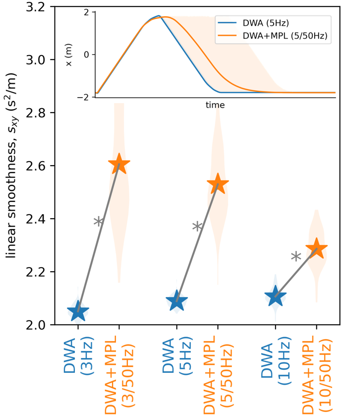
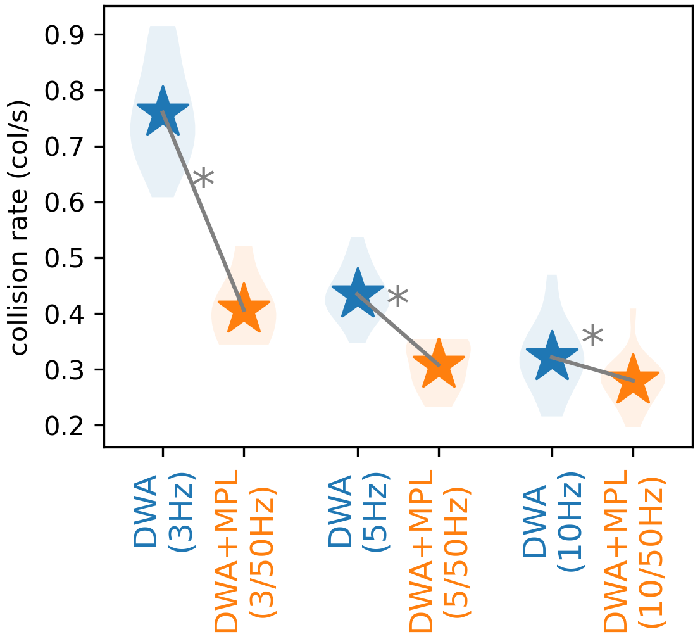

# LOFT: Long-term autOnomy For service robots in consTruction


https://ens-lab.sdu.dk/loft-project/

# Simulation

static environment            |  dynamic environment
:-------------------------:|:-------------------------:
 |    


# Setup

### Setup: Planning and Neural Control
- build the projects and add the following command to ``` ~/.bashrc ```

add ros path
```
source /opt/ros/noetic/setup.bash
```

add project directory (i.e., the directory where LOFT folder locates). For example, ``` /home/zubuntu/Projects ```
```
export PROJECT_PATH = /home/zubuntu/Projects
```

add project directory
```
source $PROJECT_PATH/LOFT/software/projects/loft_alpha/dwa_planner/catkin_ws/devel/setup.bash --extend
source $PROJECT_PATH/LOFT/software/projects/loft_alpha/robot_control/catkin_ws/devel/setup.bash --extend
source $PROJECT_PATH/LOFT/software/projects/loft_alpha/neural_control/catkin_ws/devel/setup.bash --extend
source $PROJECT_PATH/LOFT/software/projects/loft_alpha/joystick/catkin_ws/devel/setup.bash --extend
source $PROJECT_PATH/LOFT/software/projects/loft_alpha/socket/catkin_ws/devel/setup.bash --extend
```

### Setup: Human Detection

### Setup: Robot Interface

# Running

### Running: ROS setup
- Initialize ros systems (one on the Jetson and another on the PC). Note that two ros systems communicate through pysocket.

### Running: Human Detection
- Start the human detection programs (DTU) and the publisher socket (SDU).

### Running: Planning and Neural Control (Neural Proactive Control; NPC)

- Start the coppeliasim scene
- Start the planning and neural control (SDU) by open the rqt gui using the following command.
```
cd perspect
rqt --perspective-file "loft.perspective"
```
- The following window will pop up.

- Modify the launch file located in ```software/projects/loft_alpha/robot_control/catkin_ws/src/robot_control/launch/ ```.
- On the "ROS Launch GUI" tab, select "robot_control" package and "loft.launch" file. Click "START ALL" to run the launch file.


### Running: Robot Interface
- Start the robot interface (DTI).


# Results

### Corridor Simulation

This result was obtained from the controllers operating at 5 Hz, in a corridor simulation.




statistics (mean)    | only planning (blue) | with NPC (orange) 
:-------------------:|:-------------:|:------------:
forward acceleration |   1.769 cm/s  | 1.520 cm/s
sideway acceleration |   0.029 cm/s  | 0.021 cm/s
yaw acceleration     |   0.128 cm/s  | 0.115 cm/s


### Dynamic Simulated Environment

This result was obtained from the controllers operating at 2 Hz, in a dynamic environment simulation.



statistics (mean)     |       only planning (blue)     | with NPC (orange) 
:--------------------:|:-----------------------:|:----------------------:
hit rate              |   0.041 hit/timestep    | 0.026 hit/timestep
goal achievement rate |   0.0030 goal/timestep  | 0.0037 goal/timestep
hit per goal achieved |   13.614 hit/goal       | 6.999 hit/goal
