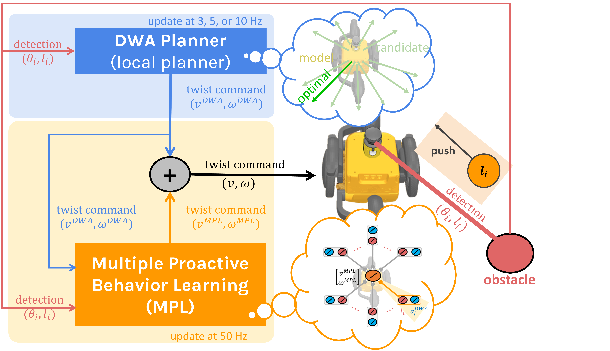
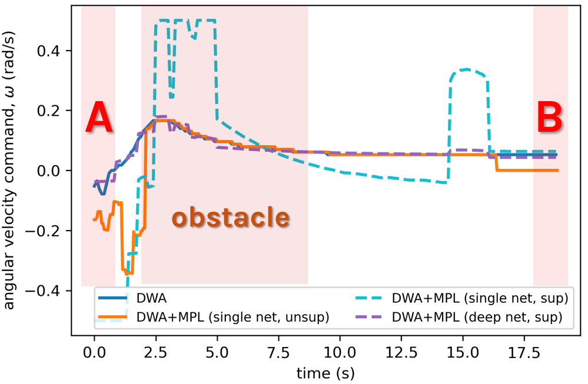

# Unsupervised Multiple Proactive Behavior Learning (MPL)

Smooth and safe navigation is an important feature of mobile robots for service applications, such as the transportation on a construction site with safe worker-robot interaction. While different control approaches have been proposed, they are still limited by the need for model-based assumptions, true training target/reward function, and training sample efficiency. To overcome these limitations, this study proposes a control architecture with a generic plug-and-play online MPL module. The MPL updates its weights unsupervisedly by correlating its sensory input to a local planner command, acting as an adaptable proactive training input. As a result, the robot autonomously and quickly learns and balances various proactive behaviors (smooth motion and collision avoidance) for smooth and safe navigation. Compared with a conventional control approach, this control architecture with leads to (1) a 29% improvement in the smoothness of robot motion in a static environment and (2) trading motion smoothness for up to 88% fewer collisions along with a 15% better success rate in a highly dynamic environment.



Project page: https://ens-lab.sdu.dk/loft-project/

## Content

- [Simulation Experiment](#simulation-experiment)
- [Supervised Learning vs Unsupervised Learning](#supervised_learning_vs_unsupervised_learning)
- [Navigation with Different Moving Obstacle Numbers and Speeds](#navigation-with-different-moving-obstacle-numbers-and-speeds)
- [Usage](#usage)


## Simulation Experiment

static environment            |  dynamic environment
:-------------------------:|:-------------------------:
 |    
 |    

## Physical Robot Experiment


The MPL was implemented on a physical robot, and the robustness to real-world uncertainties investigated, as depicted in the figure. First, the robot was placed 2.0 m in front of a human with the goal located behind. The stereo camera then detected and estimated the human pose using a stereo depth map. Next, the pose was sent to the simulation. Subsequently, the simulation created a obstacle, and the motion planning (DWA or DWA+MPL with the learned weights from the simulation experiment) applied the simulated lidar feedback to continuously produce the velocity commands. The velocity commands were then sent to the robots in real time. Finally, both physical and simulated robots moved to the goal and avoided the human. During the process, an LED light was employed to inform people for simple, safe navigation of the robot. It turned purple when no human was detected, while it turned red, yellow, and green when the closest detected human was below 2.0 m, between 2.0–2.5 m, and over 2.5 m, respectively. 

## Supervised Learning vs Unsupervised Learning 

#### Experimental Setup
To compare the performance of our unsupervised correlation-based learning (DWA+MPL (unsup.)) and supervised learning (DWA+MPL (sup.)), the robot had to move from A to B where there was an obstacle on its path. It started to drive forward and then detected an obstacle. Thus, it had to avoid the obstacle, moved forward, and stopped at the goal (B).  


For supervised learning, we used two different input-output mapping models as our MPL module and the recorded DWA planner’s outputs (velocity and angular velocity commands) as the ‘true target’. The two models are:
i)	A linear model (i.e., a simple neural network/perceptron with one input layer, one output layer, and a linear activation function, called DWA+MPL (single net, sup.)). This network setup is similar to our simple MPL model with unsupervised learning,
ii)	A more complex model (i.e., a deep neural network with 10 layers of 100 neurons each and a tanh activation function, called DWA+MPL (deep net, sup.)). 
We compared the outputs of the two models (DWA+MPL (single net and deep net, sup.)) with the recorded DWA planner’s outputs (true target) and the outputs of our proposed DWA planner + MPL (single net, unsup.). Figures below shows the setup and the comparison results. 

#### Experimental Results




When using the DWA outputs as ‘true target’, the linear model with learned/fixed control parameters (DWA+MPL (single net, sup.)) yields unusable output linear and angular velocity commands (blue dash lines in both graphs). Specifically, the linear model generated the large error outputs (i.e., large negative linear command at the beginning (0.0-2.5 s, moving backward), followed by large/overshoot positive linear and angular velocity commands at the end). 

It can also be seen that the deep network model (DWA+MPL (deep net, sup.)) can learn and fit the true target (purple dash lines in both graphs) well, as such no robot locomotion improvement could be obtained even if at a higher update rate. In order words, the deep network model followed the DWA by driving the robot with a full speed at the beginning without gradually decrease linear speed, and therefore, it could not perform proactive speed reduction or adaptation for safe obstacle avoidance. 

In contrast, our approach (DWA+MPL (single net, unsup.)), adapting the control parameters online, can generate adaptive linear and angular velocity commands, i.e., low positive linear velocity command at the beginning to gradually decrease the robot speed, then a higher speed command to reach and follow the target DWA velocity profile, and finally a zero speed to stop the robot at point B. At the same time, the angular velocity command with a negative value larger than the DWA command was generated during obstacle detection. This turns the robot further away from the obstacle and ensures that the robot successfully avoided the obstacle. This suggests that a simple model with a fast update frequency and adaptive control gains (adjustable online), as proposed here, is an efficient method for mobile robot control.


## Navigation with Different Moving Obstacle Numbers and Speeds

The robot was placed in a 10.0 x 10.0 m2 space with walking people acting as moving obstacles. The number of simulated people were tested at 4, 6, 8, and 12 people, while the speed of each was tested at 20%, 40%, and 60% of the robot maximum speed. The people cannot see or avoid the robot, so the robot's mission was to avoid collisions while moving toward random goals, which were changed after the acceptance radius of 7 cm was reached. The experiment was run for  1 hrs for each testing condition. 

The figure below presents the numbers of collision in all testing conditions, where red cell denotes the condition with high collisions (>= 20 times) and blue cell denotes the condition with few collisions (<= 10 times). At the maximum performance (i.e., maximum update rate and converged weights), the simulated robot with the proposed control (DWA+MPL 10/50 Hz) can avoid all collisions when there are four moving obstacles with speeds less than 40% of the robot maximum speed. 


## Usage

### Setup: Planning and Neural Control
- build the projects and add the following command to ``` ~/.bashrc ```

add ros path
```
source /opt/ros/noetic/setup.bash
```

add project directory (i.e., the directory where LOFT folder locates). For example, ``` /home/zubuntu/Projects ```
```
export PROJECT_PATH = /home/zubuntu/Projects
```

add project directory
```
source $PROJECT_PATH/LOFT/software/projects/loft_alpha/dwa_planner/catkin_ws/devel/setup.bash --extend
source $PROJECT_PATH/LOFT/software/projects/loft_alpha/robot_control/catkin_ws/devel/setup.bash --extend
source $PROJECT_PATH/LOFT/software/projects/loft_alpha/neural_control/catkin_ws/devel/setup.bash --extend
source $PROJECT_PATH/LOFT/software/projects/loft_alpha/joystick/catkin_ws/devel/setup.bash --extend
source $PROJECT_PATH/LOFT/software/projects/loft_alpha/socket/catkin_ws/devel/setup.bash --extend
```

### Setup: Human Detection

### Setup: Robot Interface

### Setup: ROS setup (physical robot)
- Initialize ros systems (one on the Jetson and another on the PC). Note that two ros systems communicate through pysocket.

### Running: Human Detection
- Start the human detection programs (DTU) and the publisher socket (SDU).

### Running: Planning and Neural Control (Multiple Proactive Behavior Learning; MPL)

- Start the coppeliasim scene
- Start the planning and neural control (SDU) by open the rqt gui using the following command.
```
cd perspect
rqt --perspective-file "loft.perspective"
```
- The following window will pop up.

- Modify the launch file located in ```software/projects/loft_alpha/robot_control/catkin_ws/src/robot_control/launch/ ```.
- On the "ROS Launch GUI" tab, select "robot_control" package and "loft.launch" file. Click "START ALL" to run the launch file.


### Running: Robot Interface
- Start the robot interface.

